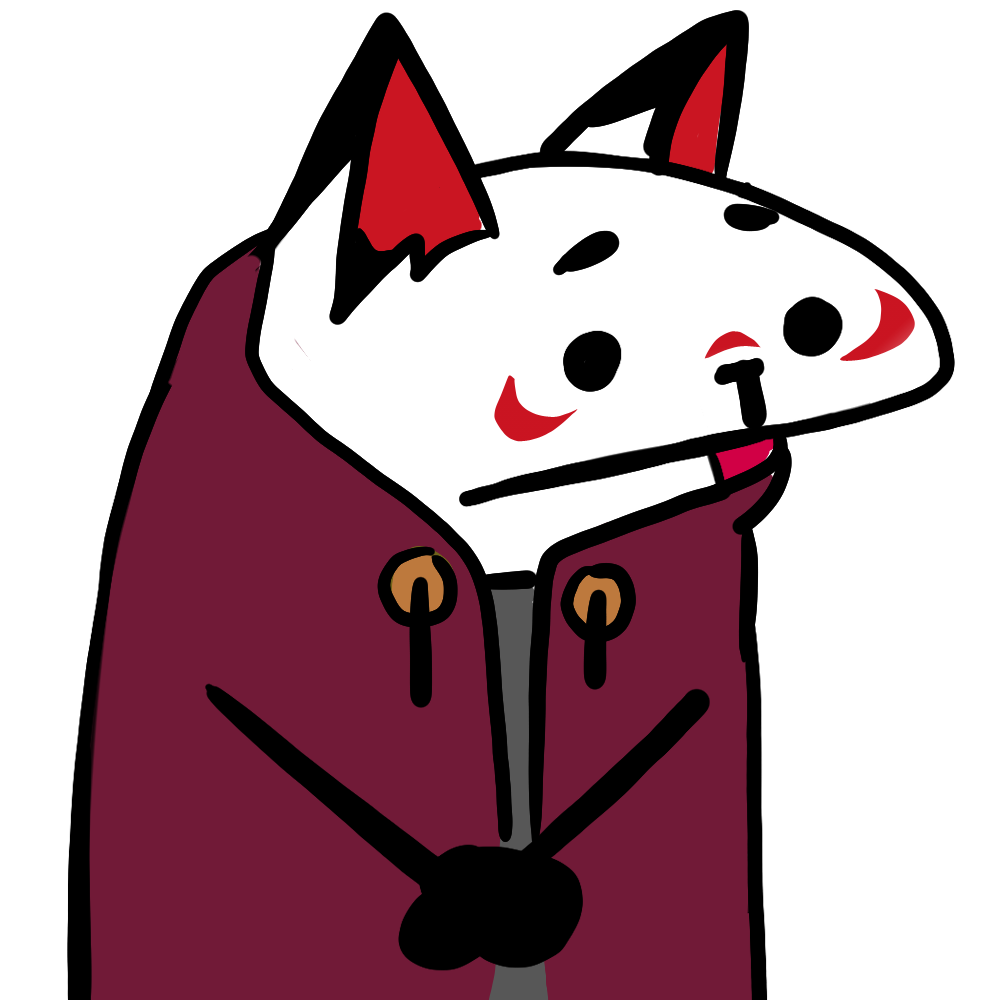
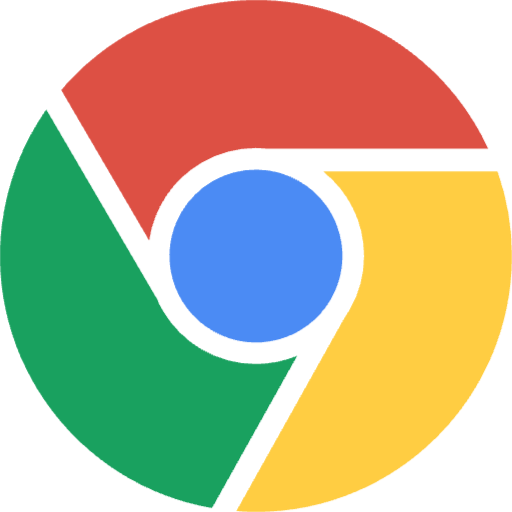

 <h1 align="center">Hi there!  I'm Alex!</h1>

    
    
    

:point_right: Hi! I’m a passionate web developer with a love for frontend design and user experiences. My background in sound design and composing for a game studio sparked my interest in coding and UI/UX because I helped out in this area while working there, and I’ve since gained experience in both frontend and backend technologies. I’m always eager to learn and strive to create seamless, user-friendly designs.

Skills & Tools :bulb:

<h3 align="center">Languages & Frameworks :computer:</h3>

    
    
    
    
    
    
    
    
    
    
    

<h2>:mag: Find me around the web:</h2>

### :musical_note: I'm listening to:

<h3 align="center">Contribution Snake</h3>

  

<!--
**daincoding/daincoding** is a ✨ _special_ ✨ repository because its `README.md` (this file) appears on your GitHub profile.

Here are some ideas to get you started:

- 🔭 I’m currently working on ...
- 🌱 I’m currently learning ...
- 👯 I’m looking to collaborate on ...
- 🤔 I’m looking for help with ...
- 💬 Ask me about ...
- 📫 How to reach me: ...
- 😄 Pronouns: ...
- ⚡ Fun fact: ...
-->
