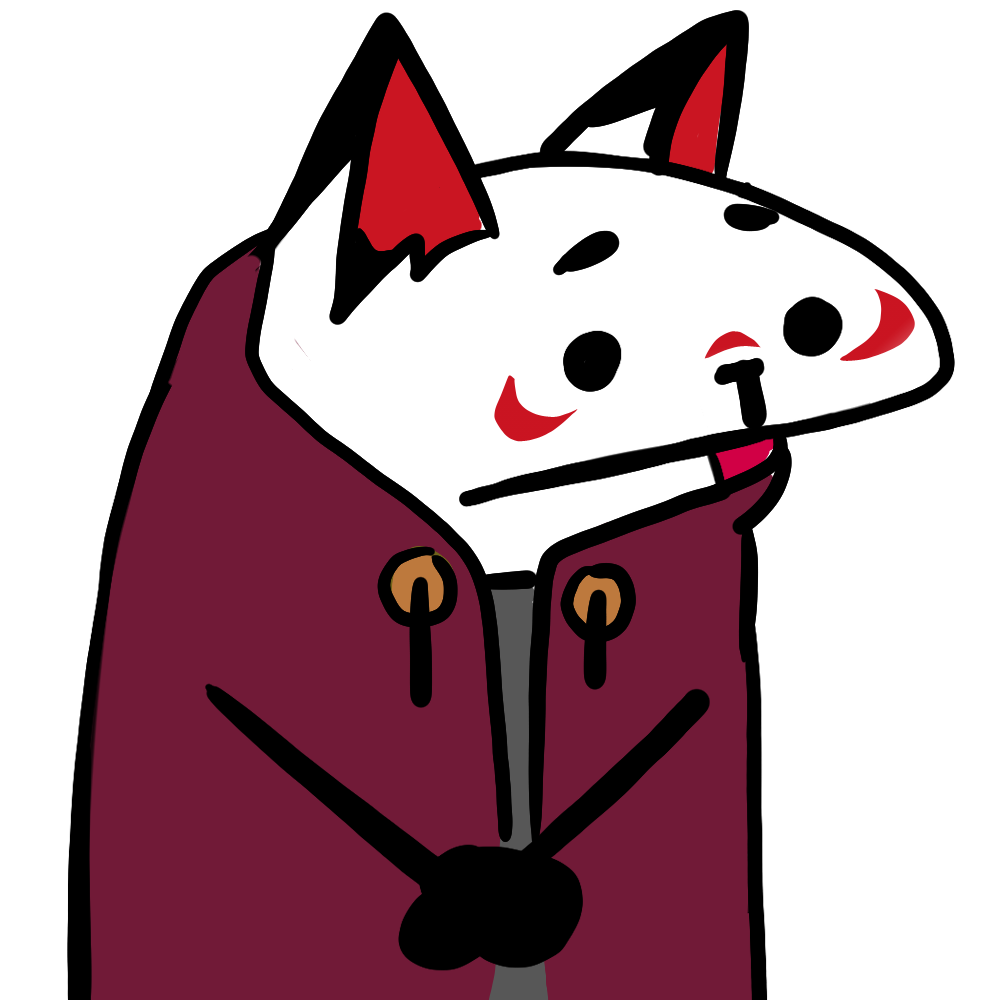
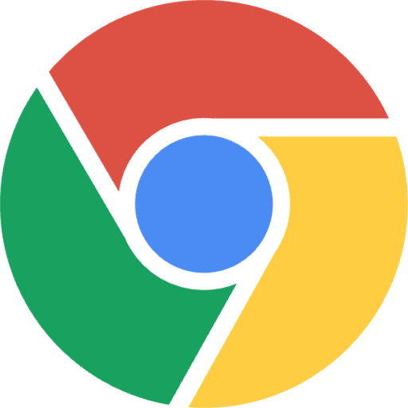

 <h1 align="center">Hi there!  I'm Alex!</h1>

    
    
    
    

:point_right: Hi! I’m a web developer with a background in sound design, currently focused on Java. I’m especially interested in frontend design and enjoy building clean, user-friendly interfaces.

Skills & Tools :bulb:

<h3 align="center">Languages & Frameworks :computer:</h3>

    
    
    
    
    
    
    
    
    
    

<h3 align="center">Currently Learning :computer:</h3>

    

<h2>:mag: Find me around the web:</h2>

<h3 align="center">Contribution Snake</h3>

<!--
**daincoding/daincoding** is a ✨ _special_ ✨ repository because its `README.md` (this file) appears on your GitHub profile.

Here are some ideas to get you started:

- 🔭 I’m currently working on ...
- 🌱 I’m currently learning ...
- 👯 I’m looking to collaborate on ...
- 🤔 I’m looking for help with ...
- 💬 Ask me about ...
- 📫 How to reach me: ...
- 😄 Pronouns: ...
- ⚡ Fun fact: ...
-->
